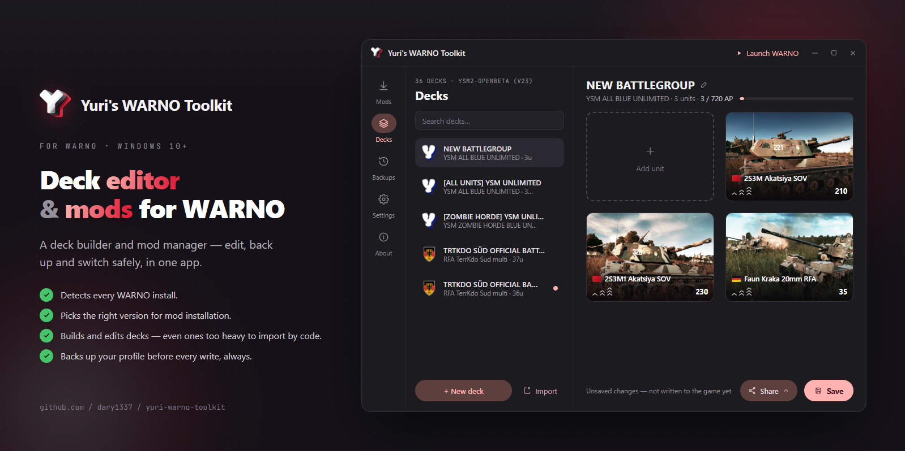

<h1 align="left">Yuri's WARNO Toolkit&nbsp;&nbsp;</h1>

  

  Edit your WARNO battlegroups directly on your profile — even the decks the game won't let you build — with one-click <b>YSM</b> install built in.

> [!IMPORTANT]
> **Now in open beta.** Hit a bug or have an idea? Tell us on the [YSM Community Discord](https://discord.gg/YWXzmt8psB) — it shapes what gets built next.

A full **battlegroup editor** that works directly on your WARNO profile — read, edit and build decks, including the ones WARNO hides or won't let you import — with one-click install of **YSM** and its collaborations built in.

## What it does

**Edits your battlegroups** — the heart of the toolkit. It reads every deck in your profile, *including the ones WARNO hides* (built under another mod or an older game build), and lets you edit units, veterancy and transports; rename, delete, duplicate, or copy a deck to the other coalition; or build new battlegroups from scratch — with full unit art, division emblems and flags. It even builds decks **too heavy to share by in-game code**, past WARNO's import limit, by writing them straight into your profile. Every change goes back into the game profile — always backed up and verified first.

**Installs the mods** — YSM, WTO, YSM × WiF, YSM × WiF × WTO in one click. Finds your WARNO (Steam or non-Steam), picks the build that matches your game version, backs up your current setup first, and rolls back if anything fails.

**Profile backups** — snapshot and restore your whole profile; every change is reversible.

## Mod catalog

This repository is the app's public **mod catalog**: [`mods-list.json`](mods-list.json) lists every supported mod and its builds. New mods and builds are added here — the app picks them up with no update needed.

## Community

Questions, bug reports, and deck talk happen on the **[YSM Community Discord](https://discord.gg/YWXzmt8psB)**.

## Disclaimer

Not affiliated with or endorsed by Eugen Systems. Works on your own legal installation of WARNO — game data is read from your own install; nothing is bundled. Your profile is backed up before every write, and writes are refused if the save format changes.
